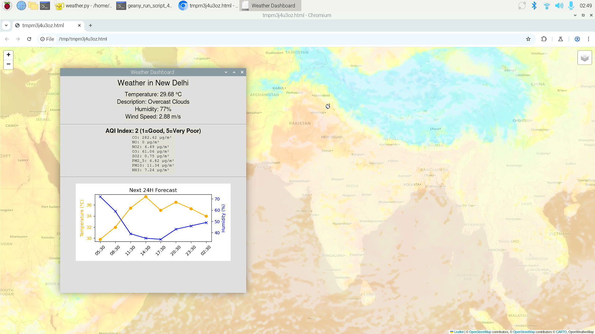
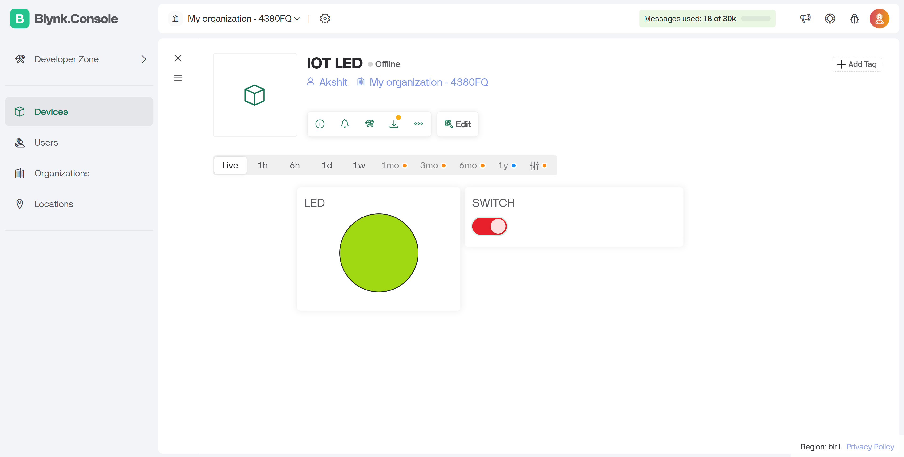
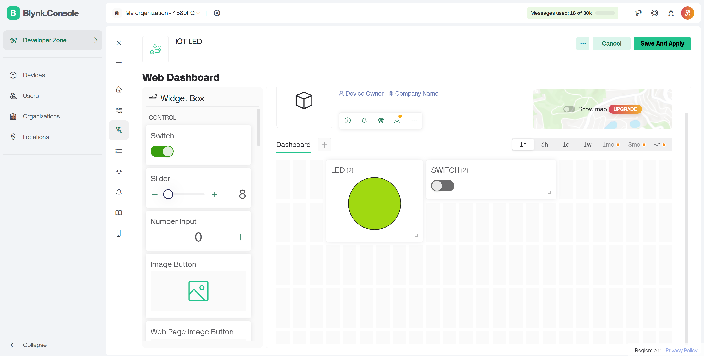
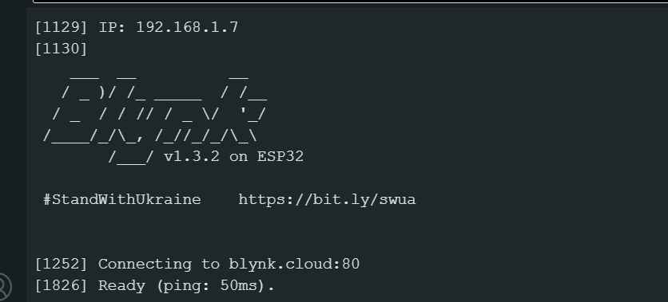
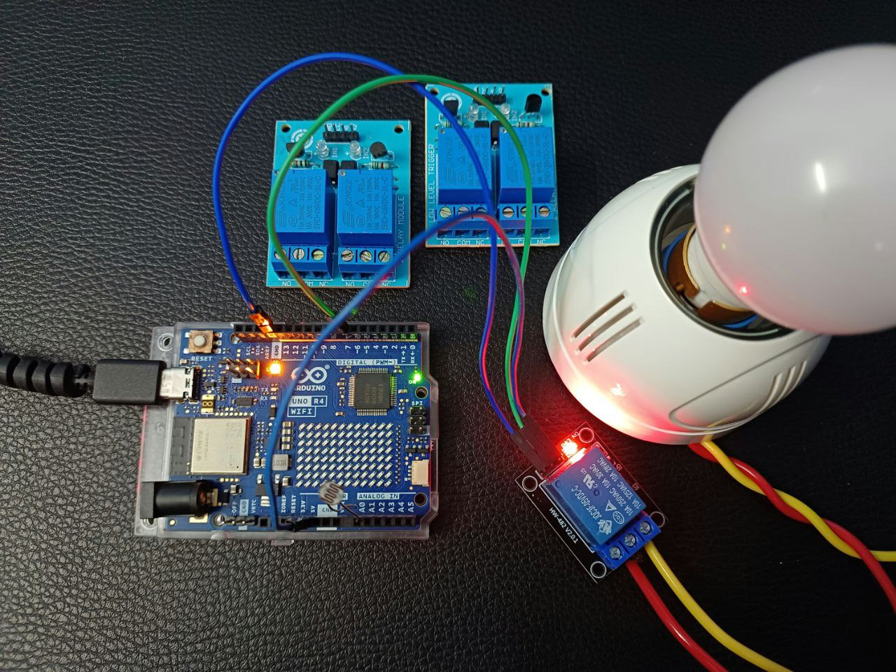
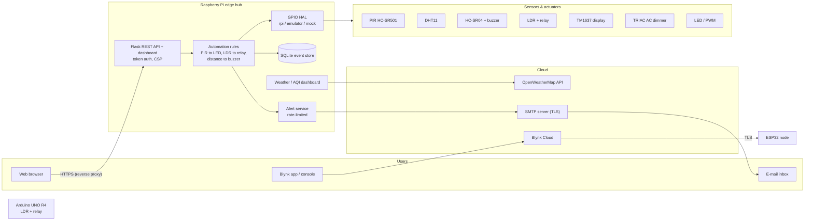
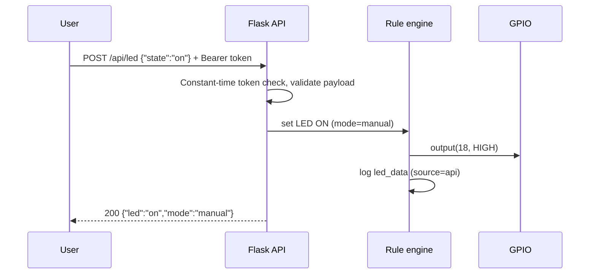

<div align="center">

# Secure IoT Home Automation & Monitoring Platform

**A multi-tier, edge-first smart-home system built on Raspberry Pi, ESP32 and Arduino: sensing, actuation, cloud and web control, alerting, and environmental intelligence, designed with security as a first-class requirement.**

[](https://github.com/Akshit0203/secure-iot-home-automation/actions/workflows/ci.yml)


</div>

---

## Table of Contents
- [Overview](#overview)
- [Key Features](#key-features)
- [System Architecture](#system-architecture)
- [Repository Structure](#repository-structure)
- [Hardware](#hardware)
- [Quick Start](#quick-start)
- [Security Design](#security-design)
- [Results & Screenshots](#results--screenshots)
- [Engineering Notes](#engineering-notes)
- [Roadmap](#roadmap)
- [Project Report](#project-report)
- [License](#license)

---

## Overview

Commercial home-automation ecosystems tend to be **expensive, vendor-locked, hard to scale and weak on security**. This project implements a low-cost, modular alternative built from commodity IoT primitives across three tiers:

| Tier | Hardware | Role |
|------|----------|------|
| **Edge hub** | Raspberry Pi 4 / 5 | Sensor fusion, local automation rules, REST API and web dashboard, SQLite event log, e-mail alerting, weather/AQI intelligence |
| **Cloud node** | ESP32 | Wi-Fi appliance control through **Blynk IoT** (web + mobile), TLS transport, auto-reconnect |
| **Standalone node** | Arduino UNO R4 WiFi | Autonomous dusk-to-dawn lighting with an LDR and a mains relay |

Automation decisions run **locally on the edge** (low latency, works offline). Cloud and web paths are used for remote control and monitoring.

> Developed as an academic research project, *"A Synchronised Home Automation Framework using IoT Ecosystem Primitives"*. The full report is in [`docs/report/`](docs/report/Project-Report.pdf).

----

## Results & Screenshots

| Weather & AQI dashboard on Raspberry Pi 5 | Blynk IoT console (ESP32 node) |
|:--:|:--:|
|  |  |
| **Blynk web dashboard builder** | **ESP32 connected to Blynk Cloud** |
|  |  |
| **Arduino UNO R4 LDR + relay night-light** | **DHT11 wiring to Raspberry Pi** |
|  |  |

## Demo video (weather dashboard on Raspberry Pi 5 with voice output):
<video src="https://github.com/user-attachments/assets/faf3f058-8868-4b76-a880-5b66b208e583" width="100%" controls></video>
<br>

---

## Key Features

### Edge hub (Raspberry Pi, `raspberry-pi/homeauto`)
| Module | Description | Run |
|--------|-------------|-----|
| **Web control plane** | Flask REST API and responsive dashboard: LED/relay control, *auto* (PIR presence) and *manual* modes, live motion and climate. Bearer-token auth, CSP, POST-only state changes | `python -m homeauto.web.app` |
| **Motion detection** | HC-SR501 PIR → presence lighting, rising-edge event logging, optional e-mail alert | (part of web app / GUI) |
| **Climate monitoring** | DHT11 temperature and humidity at 0.5 Hz, persisted to SQLite | `python -m homeauto.sensors.dht11` |
| **7-segment display** | TM1637 shows `TT:HH` (°C : %RH) locally | `python -m homeauto.display.tm1637_climate` |
| **Proximity alert** | HC-SR04 ultrasonic ranging (median filter, echo timeout) → buzzer | `python -m homeauto.sensors.ultrasonic` |
| **Light automation** | LDR comparator → active-LOW relay, edge-triggered | `python -m homeauto.sensors.ldr` |
| **AC dimmer** | Zero-cross detection + TRIAC phase-angle control, mains-frequency aware | `python -m homeauto.actuators.ac_dimmer` |
| **PWM lighting** | 1 kHz hardware-PWM LED brightness sweep | `python -m homeauto.actuators.pwm_led` |
| **E-mail alerts** | SMTPS (TLS-verified) with per-event cooldown to prevent alert storms | `python -m homeauto.alerts.email_alert` |
| **Desktop console** | Tkinter monitor with Motion, LED and History tabs, thread-safe and SQLite-backed | `python -m homeauto.gui.sensor_monitor` |
| **Weather & AQI dashboard** | OpenWeatherMap current, 24 h forecast plot, AQI with pollutant breakdown, Folium live map, spoken temperature (gTTS) | `python -m homeauto.weather.dashboard` |
| **City forecast GUI** | City search, 5-day forecast, condition icons, light/dark theme | `python -m homeauto.weather.city_forecast` |

### Microcontroller firmware (`firmware/`)
- **`esp32-blynk-led`**: Blynk IoT node with switch (V0) → GPIO and state feedback (V1). Uses TLS, a non-blocking connect, a connection watchdog, state re-sync after reconnect, and input validation.
- **`arduino-ldr-relay`**: Autonomous night-light with **hysteresis** (separate ON/OFF thresholds) to prevent relay chatter, and Serial Plotter telemetry.

### Platform qualities
- **Hardware abstraction layer**: one codebase runs on real GPIO, on the [raspberry-gpio-emulator](https://github.com/nosix/raspberry-gpio-emulator) GUI, or on a headless mock. CI runs the full test suite with no hardware attached.
- **Zero hard-coded secrets**: every credential comes from `.env` or `secrets.h`, both git-ignored.
- **Single conflict-free pin map** so all modules can run on one Pi at the same time. Every pin can be overridden through environment variables.
- **CI pipeline**: ruff lint, pytest, Arduino compile, and gitleaks secret scanning.

---

## System Architecture



Sequence for a web-initiated LED command:



More diagrams and the data-flow description are in [`docs/architecture.md`](docs/architecture.md).

---

## Repository Structure

```
secure-iot-home-automation/
├── raspberry-pi/                  # Edge hub (Python package "homeauto")
│   ├── homeauto/
│   │   ├── config.py              # env-driven settings + conflict-free BCM pin map
│   │   ├── storage.py             # thread-safe SQLite event store
│   │   ├── hal/gpio.py            # GPIO abstraction: RPi.GPIO | emulator | mock
│   │   ├── sensors/               # dht11, ultrasonic, ldr
│   │   ├── actuators/             # pwm_led, ac_dimmer
│   │   ├── display/               # tm1637_climate
│   │   ├── alerts/                # email_alert (SMTPS + rate limiting)
│   │   ├── web/                   # Flask API, templates, static assets
│   │   ├── gui/                   # Tkinter sensor monitoring console
│   │   └── weather/               # OWM client, Pi 5 dashboard, city forecast GUI
│   ├── tests/                     # pytest suite (runs without hardware)
│   ├── requirements.txt
│   ├── requirements-dev.txt
│   ├── pyproject.toml
│   └── .env.example
├── firmware/
│   ├── esp32-blynk-led/           # ESP32 + Blynk IoT (TLS)
│   └── arduino-ldr-relay/         # Arduino UNO R4 WiFi night-light
├── docs/
│   ├── architecture.md
│   ├── hardware.md                # BOM, pin map, wiring and safety notes
│   ├── setup.md                   # installation and deployment guide
│   ├── security-model.md          # threat model and controls
│   ├── images/
│   └── report/Project-Report.pdf
├── .github/workflows/ci.yml
├── SECURITY.md
├── CHANGELOG.md
└── LICENSE
```

---

## Hardware

| Component | Qty | Purpose |
|-----------|-----|---------|
| Raspberry Pi 4 Model B / Raspberry Pi 5 | 1 | Edge hub |
| ESP32 Dev Module | 1 | Blynk cloud node |
| Arduino UNO R4 WiFi | 1 | Standalone lighting node |
| HC-SR501 PIR sensor | 1 | Motion / presence |
| DHT11 | 1 | Temperature and humidity |
| HC-SR04 ultrasonic sensor + active buzzer | 1 + 1 | Proximity alert |
| LDR module (comparator, DO/AO) | 2 | Ambient light |
| 5 V single-channel relay module | 2 | Mains switching |
| TM1637 4-digit 7-segment display | 1 | Local readout |
| Zero-cross TRIAC dimmer module | 1 | AC brightness control |
| LEDs, resistors (220 Ω, 1 kΩ / 2 kΩ divider), breadboard, jumpers, 12 V fan | – | Prototyping |

Full pin map, wiring diagrams and **mains-safety notes** are in [`docs/hardware.md`](docs/hardware.md).

---

## Quick Start

```bash
git clone https://github.com/Akshit0203/secure-iot-home-automation.git
cd secure-iot-home-automation/raspberry-pi

python3 -m venv .venv && source .venv/bin/activate
pip install -r requirements.txt

cp .env.example .env
python -c "import secrets; print(secrets.token_urlsafe(32))"   # paste into HOMEAUTO_API_TOKEN
nano .env                                                       # add OWM / SMTP keys as needed

python -m homeauto.web.app          # open http://127.0.0.1:5000
```

**No Raspberry Pi?** Set `HOMEAUTO_GPIO_BACKEND=mock` (headless) or `emulator` (GUI) and every module runs on a laptop.

Run the tests:
```bash
pip install -r requirements-dev.txt
HOMEAUTO_GPIO_BACKEND=mock pytest -q
```

Flashing the firmware, running as a `systemd` service and exposing the API over HTTPS are covered in [`docs/setup.md`](docs/setup.md).

---

## Security Design

Security was a core requirement, not an afterthought. Summary of the controls (full threat model in [`docs/security-model.md`](docs/security-model.md)):

| Threat | Control |
|--------|---------|
| Credential leakage via source control | All secrets in `.env` / `secrets.h` (git-ignored), `.env.example` templates, **gitleaks** in CI |
| Unauthorised device control | Mandatory ≥24-char bearer token, `hmac.compare_digest` constant-time check |
| CSRF / drive-by toggling | State changes only via `POST` + JSON; no state-changing `GET` routes |
| Injection | Strict allow-list validation (`on`/`off`, `auto`/`manual`), parameterised SQL, no `shell=True` |
| XSS / clickjacking | `Content-Security-Policy: default-src 'self'`, `X-Frame-Options: DENY`, `nosniff`, no inline scripts |
| Network exposure | API binds to `127.0.0.1` by default; LAN or remote access only behind a TLS reverse proxy |
| Eavesdropping on the IoT link | ESP32 ↔ Blynk over **TLS** (`BlynkSimpleEsp32_SSL.h`), SMTPS with certificate verification |
| Alert flooding / DoS of inbox | Per-event cooldown rate limiter |
| Unsafe failure states | Actuators default **OFF** at boot and on exit (`GPIO.cleanup`), 1 KB request limit |

---

## Engineering Notes

- **Ultrasonic ranging**: `d = t · 343 m/s / 2`. Each reading is the median of 3 pings spaced 60 ms apart, which rejects spurious echoes. A 38 ms echo timeout replaces the unbounded busy-wait loops. The 5 V ECHO line needs a 1 kΩ/2 kΩ divider before it reaches the Pi's 3.3 V GPIO.
- **Phase-angle dimming**: the firing delay is `(1 − level/100) · 1/(2·f)`, so a half-cycle is 10 ms at 50 Hz. A 200 µs guard keeps the TRIAC from firing too close to the next zero crossing. Linux user-space jitter can cause flicker, so production designs should fire the TRIAC from a microcontroller hardware timer.
- **DHT11**: its maximum sampling rate is 1 Hz. The pipeline polls every 2–5 s and treats failed reads as `None` instead of crashing.
- **Thread safety**: the sensor threads never touch Tk widgets. Results go through a queue and the UI picks them up with `root.after`. SQLite access is serialised with a lock.
- **Hysteresis** in the Arduino sketch (ON ≤ 25, OFF ≥ 35) prevents relay oscillation at dusk.

---

## Roadmap

- [ ] MQTT (Mosquitto + TLS + per-device ACLs) as the unified message bus between nodes
- [ ] Face-recognition access control (PiCamera2 + `face_recognition`); prototype documented in the report
- [ ] Natural-language "chat with your home" assistant over the SQLite event log (LangChain + Groq); prototype documented in the report
- [ ] Predictive energy optimisation from historical usage
- [ ] Native mobile app and voice-assistant integration
- [ ] OTA firmware updates with signed images

---

## Project Report

[`docs/report/Project-Report.pdf`](docs/report/Project-Report.pdf) covers the literature survey, system architecture, component theory (PIR pyroelectric sensing, DHT11, HC-SR04, TM1637, TRIAC phase control, LDR), DFDs, sequence diagrams, and conclusions.

---

## Author

**Akshit** · [GitHub @Akshit0203](https://github.com/Akshit0203)

## License

Released under the [MIT License](LICENSE).

> ⚠️ **Safety disclaimer:** the relay and AC-dimmer circuits switch mains voltage, which can kill. Build them only if you are qualified to do so, and use isolated modules and enclosures.
