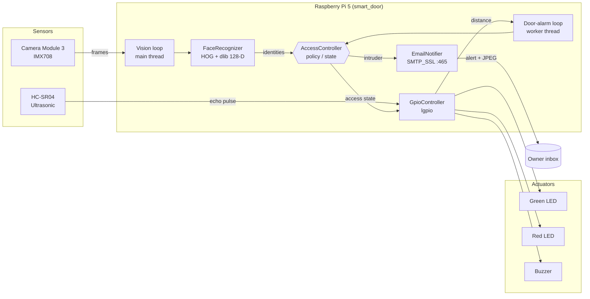
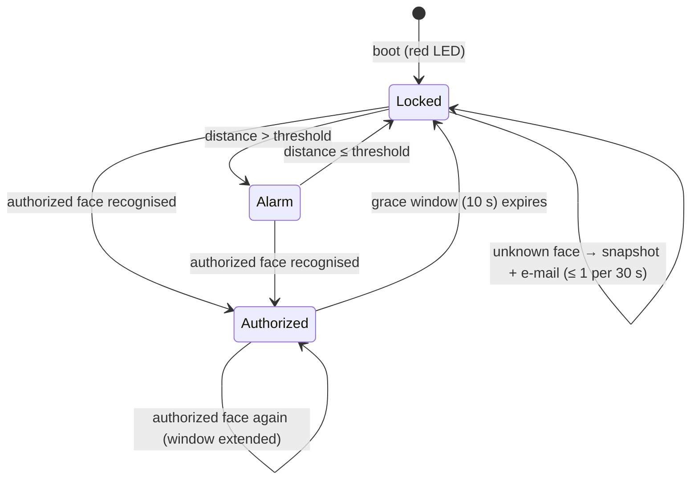
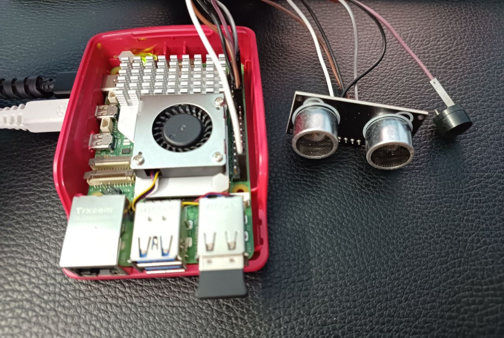

<div align="center">

# 🚪🔐 AI-Powered Smart Door Security & IoT Monitoring System

**Edge-AI access control on a Raspberry Pi 5: real-time face recognition, ultrasonic door-breach sensing, GPIO alarms and SMTP intrusion alerts with photo evidence.**

[](https://github.com/Akshit0203/AI-Powered-Smart-Door-Security-IoT-Monitoring-System/actions/workflows/ci.yml)


</div>

---

## 📌 Overview

This project turns a Raspberry Pi 5 and Camera Module 3 into a self-contained **smart door controller** that runs entirely on-device. No cloud inference, no third-party video service.

1. The **vision pipeline** detects faces with a HOG detector and identifies them using 128-dimensional dlib ResNet embeddings.
2. An **authorized** face turns on the green LED, turns off the red one, and opens a configurable *grace window* during which the door alarm is suppressed.
3. An **unknown or non-authorized** face is annotated, saved as a JPEG and sent as an **e-mail alert** over SMTP/SSL. Alerts are rate-limited so you don't get flooded.
4. In parallel, an **HC-SR04 ultrasonic sensor** watches the door leaf. If the door opens outside a grace window, the **buzzer sounds**.

The repository also contains the standalone hardware modules built along the way: a PIR motion sensor, an ultrasonic + NeoPixel proximity indicator, and an SMTP alert tester.

## ✨ Key Features

| Area | Capability |
|---|---|
| **Face recognition** | HOG detection + dlib ResNet-34 embeddings (128-D), Euclidean matching with tunable tolerance, 1/4-scale inference for real-time CPU throughput |
| **Access policy** | Multi-user allow-list, time-boxed authorization grace window, fail-closed default (red LED on boot) |
| **Intrusion response** | Annotated snapshot evidence, asynchronous SMTP-over-SSL alerts with JPEG attachment, configurable cooldown |
| **Door sensing** | HC-SR04 time-of-flight ranging with bounded echo timeouts (no busy-wait hangs) and threshold-based breach detection |
| **Concurrency** | Vision loop on the main thread (required by OpenCV HighGUI), alarm loop on a worker thread, lock-protected shared state and GPIO access |
| **Ops** | `.env`-based config (no secrets in code), headless mode, `systemd` unit with clean SIGTERM shutdown, structured logging |
| **Quality** | Hardware-independent policy layer covered by `pytest`, `ruff` linting, GitHub Actions CI on Python 3.11–3.13 |

## 🏗️ System Architecture



Detailed design notes (threading model, state machine, timing): **[docs/ARCHITECTURE.md](docs/ARCHITECTURE.md)**

## 🔁 Decision Logic



| Condition | Green LED | Red LED | Buzzer | E-mail |
|---|:-:|:-:|:-:|:-:|
| Authorized face (or inside grace window) | ● | ○ | ○ | ○ |
| No authorized face, door closed (≤ 5 cm) | ○ | ● | ○ | ○ |
| No authorized face, door opened (> 5 cm) | ○ | ● | ● | ○ |
| Unknown / non-authorized face | (unchanged) | (unchanged) | (per door state) | ● *(rate-limited)* |

## 🧰 Hardware

| Component | Purpose |
|---|---|
| Raspberry Pi 5 (4/8 GB) + Active Cooler | Compute (quad Cortex-A76 @ 2.4 GHz) |
| Raspberry Pi Camera Module 3 (IMX708) + 22-to-15-pin FFC | Image acquisition |
| HC-SR04 ultrasonic sensor + 1 kΩ / 2 kΩ divider | Door-state ranging (5 V echo → 3.3 V) |
| Active buzzer (3.3 V, or 5 V via NPN driver) | Audible alarm |
| Green + red 5 mm LEDs + 2 × 330 Ω resistors | Access status |
| HC-SR501 PIR *(standalone module)* | Motion detection |
| WS2812B 12-pixel ring *(standalone module)* | Proximity colour indicator |

### Pin Map (BCM)

| Signal | GPIO | Physical pin |
|---|:-:|:-:|
| Green LED | 17 | 11 |
| Buzzer | 18 | 12 |
| Red LED | 27 | 13 |
| HC-SR04 TRIG | 23 | 16 |
| HC-SR04 ECHO *(via divider)* | 24 | 18 |
| PIR OUT *(example)* | 22 | 15 |
| NeoPixel DIN *(example)* | 21 | 40 |

Full wiring guide, BOM and electrical notes: **[docs/HARDWARE.md](docs/HARDWARE.md)**

<p align="center">
  
  
</p>

## 📂 Repository Structure

```text
AI-Powered-Smart-Door-Security-IoT-Monitoring-System/
├── smart_door/                     # Main application package
│   ├── __main__.py                 #   CLI entry point: python -m smart_door
│   ├── app.py                      #   Orchestrator: vision loop + door-alarm thread
│   ├── config.py                   #   Typed settings loaded from env / .env
│   ├── controller.py               #   Pure access-control policy (unit-tested)
│   ├── hardware.py                 #   lgpio driver: LEDs, buzzer, HC-SR04
│   ├── vision.py                   #   Picamera2 capture, face recognition, annotation
│   ├── notifier.py                 #   SMTP/SSL e-mail alerts (+ test sender)
│   ├── capture.py                  #   Enrolment: capture dataset images
│   └── train.py                    #   Build encodings.pickle from dataset/
├── examples/                       # Standalone hardware modules / diagnostics
│   ├── pir_motion_sensor.py        #   HC-SR501 PIR motion detection
│   └── ultrasonic_neopixel_indicator.py  # HC-SR04 + WS2812B ring
├── tests/                          # Hardware-free pytest suite
├── deploy/smart-door.service       # systemd unit for headless autostart
├── docs/                           # Architecture, hardware, setup guides + images
├── dataset/                        # Enrolment images (git-ignored)
├── captures/                       # Intruder snapshots (git-ignored)
├── .github/workflows/ci.yml        # Lint + tests on Python 3.11–3.13
├── .env.example                    # Configuration template
├── requirements.txt                # Runtime deps (Pi)
├── requirements-optional.txt       # NeoPixel example deps
├── requirements-dev.txt            # CI / test deps
└── pyproject.toml                  # Packaging, pytest and ruff config
```

## 🚀 Quick Start

> Full step-by-step instructions (OS, camera, dlib build, troubleshooting): **[docs/SETUP.md](docs/SETUP.md)**

```bash
# 1. System packages (Raspberry Pi OS 64-bit)
sudo apt update && sudo apt install -y python3-picamera2 python3-venv cmake build-essential \
     libopenblas-dev liblapack-dev libjpeg-dev

# 2. Clone and create a venv that can see the apt-installed picamera2
git clone https://github.com/Akshit0203/AI-Powered-Smart-Door-Security-IoT-Monitoring-System.git
cd AI-Powered-Smart-Door-Security-IoT-Monitoring-System
python3 -m venv --system-site-packages .venv && source .venv/bin/activate
pip install -r requirements.txt          # dlib compiles from source (~15-30 min)

# 3. Configure secrets and policy
cp .env.example .env && nano .env

# 4. Verify e-mail delivery
python -m smart_door.notifier

# 5. Enrol faces (SPACE = capture, q = quit); repeat per person
python -m smart_door.capture --name Akshit

# 6. Build the encoding database
python -m smart_door.train

# 7. Run (with preview window), or headless for SSH / systemd
python -m smart_door
python -m smart_door --headless --log-level DEBUG
```

### Run at boot

```bash
sudo cp deploy/smart-door.service /etc/systemd/system/
sudo systemctl daemon-reload && sudo systemctl enable --now smart-door
journalctl -u smart-door -f
```

## ⚙️ Configuration

All settings are environment variables (see [`.env.example`](.env.example)):

| Variable | Default | Description |
|---|---|---|
| `AUTHORIZED_NAMES` | `Akshit` | Comma-separated allow-list (dataset folder names, case-insensitive) |
| `AUTH_GRACE_SECONDS` | `10` | How long access stays granted after a recognised face |
| `ALERT_COOLDOWN_SECONDS` | `30` | Minimum gap between intruder e-mails |
| `DOOR_OPEN_THRESHOLD_CM` | `5` | Distance above which the door counts as open |
| `MATCH_TOLERANCE` | `0.6` | Max embedding distance for a match (lower = stricter) |
| `FRAME_SCALE` | `4` | Downscale factor before detection (speed vs. range) |
| `ENCODING_MODEL` | `large` | `large` (68-pt landmarks) or `small` (5-pt). Used for both training and inference |
| `DETECTION_MODEL` | `hog` | `hog` (CPU) or `cnn` (much slower on the Pi) |
| `SMTP_USER` / `SMTP_APP_PASSWORD` / `ALERT_RECIPIENT` | – | Gmail sender, App Password, alert destination |
| `GPIO_CHIP` | `0` | `gpiochip` index of the 40-pin header |
| `PIN_*` | see pin map | BCM pin overrides |
| `HEADLESS` | `false` | Disable the OpenCV preview window |

## 🧠 How Recognition Works

```text
1920×1080 XRGB8888 ─► BGR ─► ÷4 resize (480×270) ─► RGB
        ─► HOG + linear SVM face detector ─► face boxes
        ─► 68-point landmark alignment ─► dlib ResNet-34 ─► 128-D embedding
        ─► ‖e − eᵢ‖₂ against every enrolled embedding
        ─► argmin distance ≤ tolerance ? label : "Unknown"
```

* **Enrolment** (`capture.py`) stores 640×480 images under `dataset/<name>/`.
* **Training** (`train.py`) isn't model training in the gradient-descent sense. It's *metric-learning enrolment*: the pre-trained network maps each face to an embedding, and those embeddings are serialised to `encodings.pickle`. Images with zero or multiple faces are skipped so labels can't get contaminated.
* **Inference** uses the same `ENCODING_MODEL` as enrolment so the two sets of embeddings come from the same landmark alignment.

## 🧪 Testing

The policy, configuration, notifier and sensor math are separated from the hardware, so they can be tested on any machine:

```bash
pip install -r requirements-dev.txt
ruff check .
pytest
```

## 🔒 Security & Privacy Considerations

* **Secrets** are loaded from `.env` (git-ignored). Use a **Gmail App Password** on a dedicated sender account, never your primary password.
* **Biometric data** (`dataset/`, `captures/`, `*.pickle`) is git-ignored and never leaves the device except as alert attachments.
* `encodings.pickle` is deserialised with `pickle`. Only load files you generated yourself.
* **Limitations:** 2D face recognition has **no liveness detection** and can be spoofed with a photo or screen. Treat this as a monitoring and deterrence system, not a replacement for a certified access-control product. See [SECURITY.md](SECURITY.md).

## 🗺️ Roadmap

- [ ] Liveness / anti-spoofing (blink detection or depth sensor)
- [ ] Relay-driven electronic strike lock
- [ ] MQTT / Home Assistant integration and Telegram alerts
- [ ] PIR-triggered wake-up to idle the vision pipeline and save power
- [ ] Event log with a small web dashboard
- [ ] Hailo-8L AI Kit acceleration for CNN detection

## 🙏 Acknowledgements

* [face_recognition](https://github.com/ageitgey/face_recognition) by Adam Geitgey and [dlib](http://dlib.net/) by Davis King
* Enrolment/training workflow adapted from Caroline Dunn's MIT-licensed Raspberry Pi facial-recognition project and the Core Electronics Pi 5 guide
* See [THIRD_PARTY_NOTICES.md](THIRD_PARTY_NOTICES.md) and [`licenses/`](licenses)

## 📄 License

Released under the [MIT License](LICENSE).

<div align="center">

**Built by [Akshit](https://github.com/Akshit0203)**: IoT · Computer Vision · Cybersecurity

</div>
