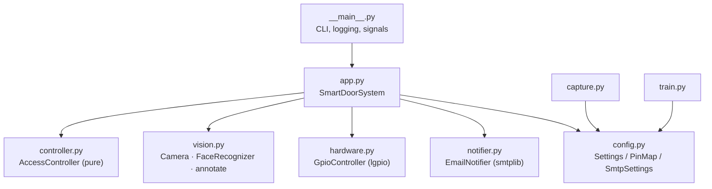
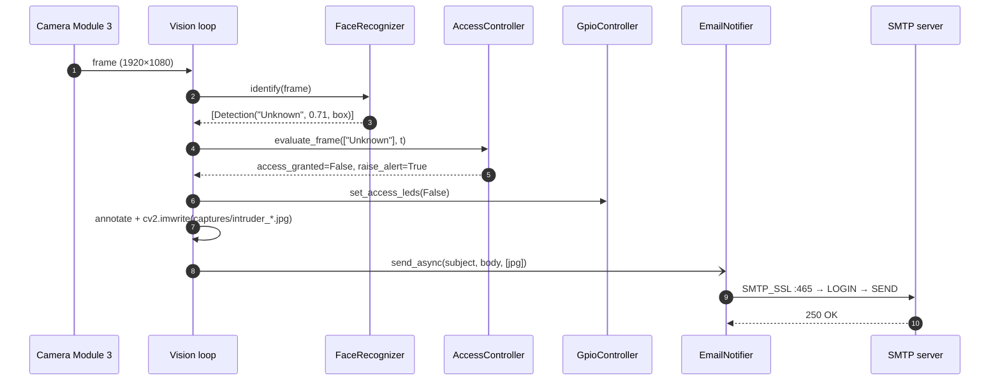

# Architecture

## Design goals

1. **Real-time on the edge.** All inference runs on the Pi 5 CPU, and the camera never streams anywhere.
2. **Fail closed.** On boot or after any timeout, the system returns to *locked* (red LED).
3. **Testable policy.** Every decision lives in a pure-Python module with no hardware imports.
4. **No secrets in source.** Credentials come from the environment.

## Module layering



| Layer | Hardware deps | Unit-tested |
|---|---|:-:|
| `config`, `controller` | none | ✅ |
| `notifier` | network (mocked) | ✅ |
| `hardware` | `lgpio` (lazy import) | ✅ (distance math) |
| `train` | `cv2`, `face_recognition` (lazy import) | ✅ (dataset walk) |
| `vision`, `app`, `capture` | camera, `cv2`, `dlib` | on-device |

## Threading model

| Thread | Work | Period |
|---|---|---|
| **MainThread** (vision loop) | capture → recognise → evaluate policy → LEDs → annotate → alert → `imshow` | frame-bound |
| **door-alarm** (daemon) | if not authorized: ping HC-SR04 → evaluate threshold → buzzer | `ALARM_POLL_INTERVAL` (1 s) |
| **smtp-alert** (daemon, per alert) | TLS handshake, login, send | on demand, ≤ 1 / cooldown |

* The vision loop stays on the **main thread** because OpenCV HighGUI (`imshow` / `waitKey`) isn't thread-safe on GTK backends. (The original prototype ran it in a worker thread.)
* SMTP runs on its **own thread**, so a slow mail server (TLS handshake plus login can take seconds) never stalls frame processing.
* Shared state (`authorized_until`, `last_alert_at`) is protected by a `threading.Lock` inside `AccessController`. GPIO writes are serialised by an `RLock` in `GpioController`, so a buzzer write can't interleave with an ultrasonic measurement.
* Shutdown is cooperative: `threading.Event` signals both loops, and `SIGTERM` (from `systemctl stop`) is mapped to the same path as Ctrl+C. GPIO lines are driven low and released, and the camera is stopped.

## Intruder alert sequence



## Ultrasonic timing

The HC-SR04 is triggered with a ≥ 10 µs pulse. It then emits an 8-cycle 40 kHz burst and holds ECHO high for the round-trip time:

```
d [cm] = t_echo [s] × 34 300 cm/s ÷ 2
```

Each wait loop is bounded by a **40 ms timeout**, which is longer than the module's ~38 ms "no obstacle" pulse. A disconnected sensor therefore returns `None` instead of hanging the thread forever, which the original busy-wait implementation could do. `time.perf_counter()` (monotonic, high resolution) is used instead of `time.time()`.

## Policy timings

| Parameter | Default | Effect |
|---|---|---|
| Grace window | 10 s | Covers the time needed to open the door and walk through after recognition |
| Alert cooldown | 30 s | One e-mail per 30 s, however many frames contain the intruder |
| Alarm poll | 1 s | Buzzer reaction latency |
| Frame scale | ¼ | About 16× fewer pixels for the HOG detector, at the cost of detection range |
