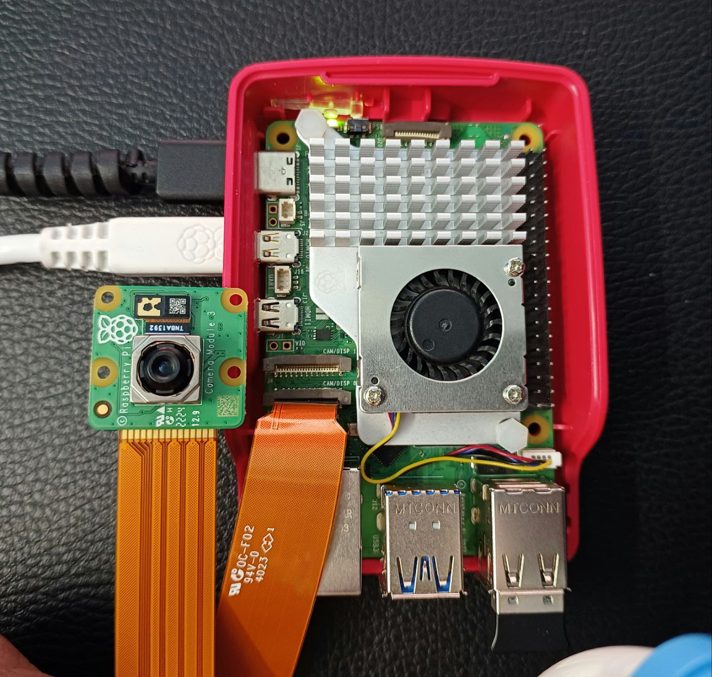
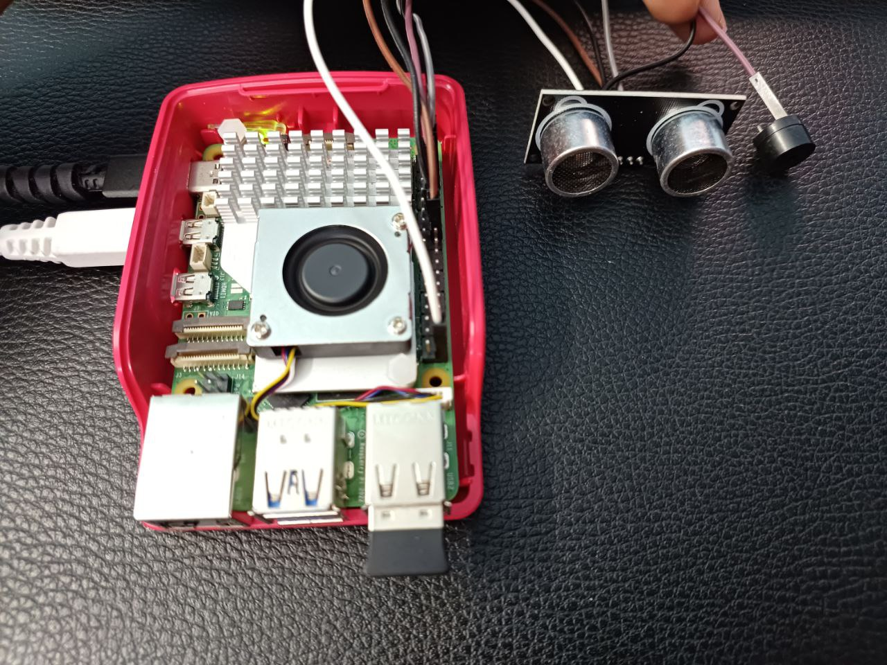
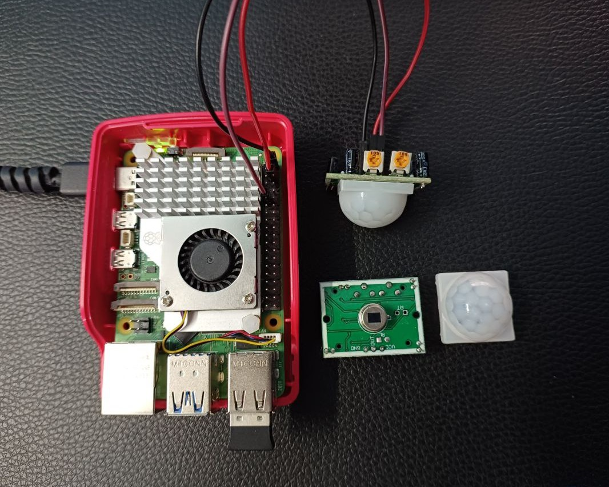

# Hardware Guide

## Bill of materials

| # | Component | Qty | Notes |
|---|---|:-:|---|
| 1 | Raspberry Pi 5 (4 GB or 8 GB) | 1 | 64-bit Raspberry Pi OS |
| 2 | Raspberry Pi Active Cooler | 1 | Recommended: sustained dlib inference is CPU-heavy |
| 3 | 27 W USB-C power supply (5 V / 5 A) | 1 | Official PSU avoids under-voltage throttling |
| 4 | Raspberry Pi Camera Module 3 (IMX708) | 1 | Autofocus; standard or wide FoV |
| 5 | Pi 5 camera cable (22-pin ↔ 15-pin) | 1 | The Pi 5 uses the smaller 22-pin CSI connector |
| 6 | HC-SR04 ultrasonic ranging module | 1 | 2–400 cm, 5 V supply |
| 7 | Resistors 1 kΩ + 2 kΩ | 1 each | ECHO level shifter (5 V → 3.3 V) |
| 8 | Active buzzer | 1 | 3.3 V type, or 5 V type via transistor |
| 9 | 5 mm LED, green + red | 1 each | Access status |
| 10 | 330 Ω resistor | 2 | LED current limiting (~4 mA) |
| 11 | HC-SR501 PIR sensor | 1 | *Standalone example* |
| 12 | WS2812B 12-LED ring | 1 | *Standalone example* |
| 13 | Breadboard + Dupont jumpers | – | |

## Wiring

```text
              Raspberry Pi 5 - 40-pin header (BCM numbering)
              ┌──────────────────┐
     3V3  (1) │ ●              ● │ (2)  5V   ──► HC-SR04 VCC, PIR VCC
          (3) │ ●              ● │ (4)  5V
          (5) │ ●              ● │ (6)  GND  ──► common ground
          (7) │ ●              ● │ (8)
     GND  (9) │ ●              ● │ (10)
  GPIO17 (11) │ ●              ● │ (12) GPIO18 ──► Buzzer (+)
  GPIO27 (13) │ ●              ● │ (14) GND
  GPIO22 (15) │ ●              ● │ (16) GPIO23 ──► HC-SR04 TRIG
     3V3 (17) │ ●              ● │ (18) GPIO24 ◄── HC-SR04 ECHO (via divider)
              │       ...        │
              │ ●              ● │ (40) GPIO21 ──► WS2812B DIN (example)
              └──────────────────┘

  GPIO17 ──[330 Ω]──►|── GND      Green LED  (access granted)
  GPIO27 ──[330 Ω]──►|── GND      Red LED    (locked)
  GPIO22 ◄────────────── PIR OUT  (example)
```

### HC-SR04 ECHO level shifting (important)

The HC-SR04 runs at **5 V** and its ECHO output swings to 5 V. Raspberry Pi GPIO is **3.3 V only and not 5 V tolerant**, so use a voltage divider:

```text
HC-SR04 ECHO ──[ 1 kΩ ]──┬──► GPIO24
                         │
                       [ 2 kΩ ]
                         │
                        GND          V_out = 5 V × 2k / (1k + 2k) ≈ 3.33 V
```

TRIG can be driven directly from 3.3 V because the module's input threshold accepts it.

### Buzzer

A 3.3 V active buzzer drawing < 15 mA can be driven directly from GPIO18. For a 5 V buzzer or anything drawing more current, use an NPN transistor (e.g. 2N2222 with a 1 kΩ base resistor) switching the buzzer from the 5 V rail.

### Mounting the door sensor

Mount the HC-SR04 on the door frame facing the door leaf so that the **closed** door sits within `DOOR_OPEN_THRESHOLD_CM` (default 5 cm). Opening the door moves the leaf away and the reading exceeds the threshold, which sounds the alarm unless an authorized face was recognised in the last `AUTH_GRACE_SECONDS`. Calibrate with:

```bash
python -m smart_door --headless --log-level DEBUG   # prints "Door distance: x.xx cm"
```

## GPIO chip on the Pi 5

On the Pi 5, the 40-pin header is driven by the **RP1** southbridge, so the legacy `RPi.GPIO` library does not work. This project uses **lgpio**. Depending on kernel version, the header appears as:

| Kernel | Header chip | `GPIO_CHIP` |
|---|---|:-:|
| ≥ 6.6.45 (current Raspberry Pi OS) | `gpiochip0` | `0` |
| older Bookworm kernels | `gpiochip4` | `4` |

Check with `gpioinfo | grep -m1 -B1 GPIO17` or `ls /dev/gpiochip*`.

## Pin conflicts between modules

| GPIO | Main system | Examples |
|:-:|---|---|
| 17 | Green LED | original PIR prototype used 17, so the example now defaults to **22** |
| 23 / 24 | HC-SR04 | NeoPixel indicator uses the same sensor, so stop the service first |
| 21 | – | NeoPixel DIN |

## Photos

| Pi 5 + Camera Module 3 | HC-SR04 + buzzer | HC-SR501 PIR |
|---|---|---|
|  |  |  |
