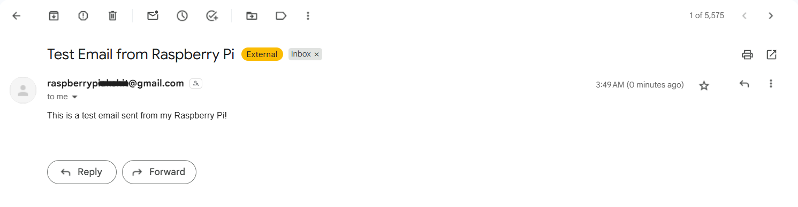

# Setup Guide

Tested target: **Raspberry Pi 5 · Raspberry Pi OS (64-bit, Bookworm) · Python 3.11 · Camera Module 3**.

## 1. Operating system

1. Flash **Raspberry Pi OS (64-bit)** with Raspberry Pi Imager. Enable SSH and set the username in the advanced options.
2. Update everything:
   ```bash
   sudo apt update && sudo apt full-upgrade -y && sudo reboot
   ```

## 2. Camera

Connect the Camera Module 3 to `CAM/DISP 0` using the 22-pin Pi 5 cable, then verify it:

```bash
rpicam-hello --list-cameras     # should list imx708
rpicam-still -o test.jpg
```

## 3. System packages

```bash
sudo apt install -y python3-picamera2 python3-venv python3-dev \
     cmake build-essential pkg-config \
     libopenblas-dev liblapack-dev libjpeg-dev libpng-dev \
     swig liblgpio-dev
```

`picamera2` depends on `libcamera`, which is only distributed through apt. That's why the virtual environment below is created with `--system-site-packages`.

## 4. Python environment

```bash
git clone https://github.com/Akshit0203/AI-Powered-Smart-Door-Security-IoT-Monitoring-System.git
cd AI-Powered-Smart-Door-Security-IoT-Monitoring-System
python3 -m venv --system-site-packages .venv
source .venv/bin/activate
pip install --upgrade pip wheel
pip install -r requirements.txt
```

> **dlib build time:** `face_recognition` depends on `dlib`, which compiles from source on ARM64 (roughly 15–30 minutes on a Pi 5). If the build is killed for running out of memory on a 4 GB board, temporarily increase swap:
> ```bash
> sudo dphys-swapfile swapoff
> sudo sed -i 's/^CONF_SWAPSIZE=.*/CONF_SWAPSIZE=2048/' /etc/dphys-swapfile
> sudo dphys-swapfile setup && sudo dphys-swapfile swapon
> ```

Optional NeoPixel example:

```bash
pip install -r requirements-optional.txt
```

## 5. GPIO permissions

Your user must be in the `gpio` and `video` groups (the default on Raspberry Pi OS):

```bash
groups            # verify
sudo usermod -aG gpio,video "$USER"   # if missing, then log out/in
```

## 6. E-mail alerts (Gmail)

1. Create a dedicated Gmail account for the Pi (recommended).
2. Enable **2-Step Verification** on that account.
3. Go to <https://myaccount.google.com/apppasswords> and create an app password named e.g. `Raspberry Pi`.
4. Put it in `.env`:
   ```bash
   cp .env.example .env
   nano .env      # SMTP_USER, SMTP_APP_PASSWORD, ALERT_RECIPIENT
   chmod 600 .env
   ```
5. Test it:
   ```bash
   python -m smart_door.notifier
   ```
   

## 7. Enrolment and training

```bash
python -m smart_door.capture --name Akshit      # 15-30 photos: vary angle, expression, lighting
python -m smart_door.capture --name Guest        # optional: enrolled but NOT in AUTHORIZED_NAMES
python -m smart_door.train                       # -> encodings.pickle
```

Tips:
* Capture under the **same lighting** as the door location.
* Include photos with and without glasses.
* If people are misidentified, lower `MATCH_TOLERANCE` (e.g. `0.5`). If you aren't recognised reliably, add more photos before raising it.

## 8. Run

```bash
python -m smart_door                 # with live preview (desktop / VNC)
python -m smart_door --headless      # SSH / service
```

## 9. Autostart with systemd

Edit `User`, `WorkingDirectory` and `ExecStart` in `deploy/smart-door.service` if your username or path differ, then:

```bash
sudo cp deploy/smart-door.service /etc/systemd/system/
sudo systemctl daemon-reload
sudo systemctl enable --now smart-door
journalctl -u smart-door -f
```

## Troubleshooting

| Symptom | Cause / fix |
|---|---|
| `lgpio.error: 'can not open gpiochip'` | Wrong `GPIO_CHIP`: try `4` on older kernels; check `ls /dev/gpiochip*` |
| `GPIO busy` | Another process (or the service) holds the line: `sudo systemctl stop smart-door` |
| `Ultrasonic: echo never went high` | TRIG/ECHO swapped, missing 5 V supply, or broken divider |
| `ModuleNotFoundError: picamera2` | venv created without `--system-site-packages` |
| `No module named 'pkg_resources'` | `pip install setuptools` (Python 3.12+) |
| `SMTPAuthenticationError 535` | Use an **App Password**, not the account password; 2FA must be enabled |
| Preview window fails over SSH | Use `--headless` or `HEADLESS=true` |
| Low FPS | Raise `FRAME_SCALE`, use `ENCODING_MODEL=small`, lower `CAMERA_WIDTH/HEIGHT` |
