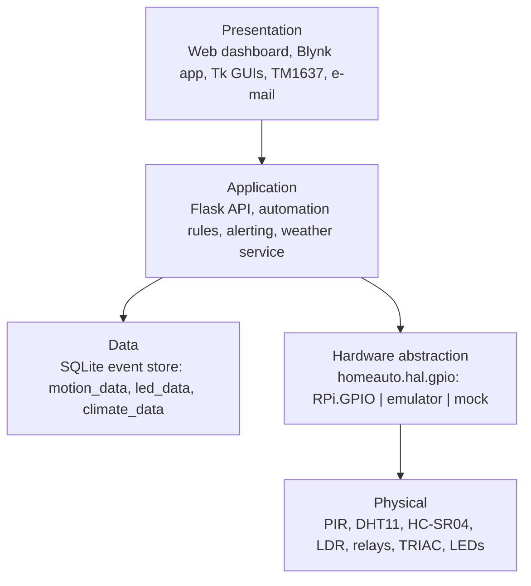
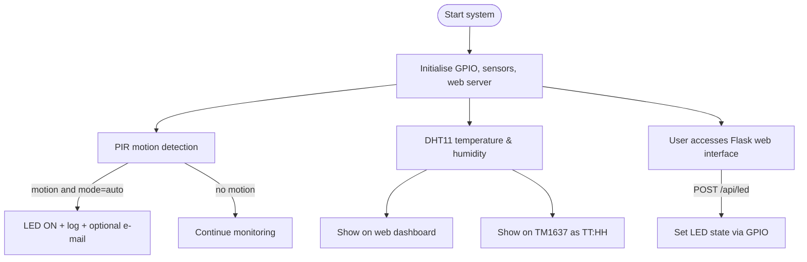
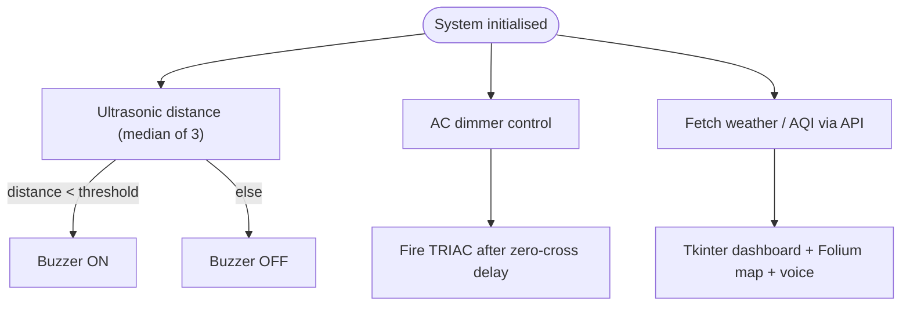
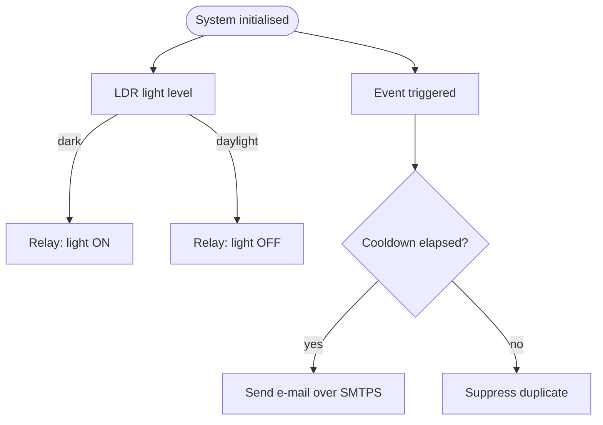
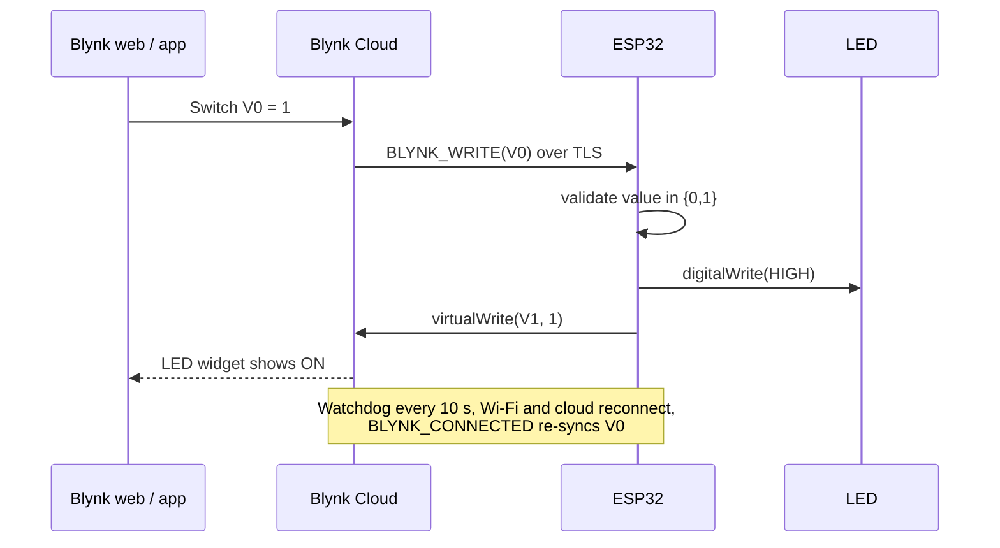

# System Architecture

## 1. Design goals

| Goal | How it is achieved |
|------|--------------------|
| **Interoperability** | Heterogeneous nodes (Raspberry Pi, ESP32, Arduino) integrated over Wi-Fi, HTTP/REST and Blynk IoT |
| **Low latency, offline resilience** | Automation rules run on the edge hub. The cloud is only used for remote access |
| **Security** | Token-authenticated API, TLS transports, secret isolation, least exposure (see [security-model.md](security-model.md)) |
| **Scalability** | Modular Python package: each sensor or actuator is an independent module behind a common HAL and config |
| **Cost** | Commodity sensors, all under USD 5 each, and open-source software |

## 2. Layered view

## 3. Data-flow diagrams

### 3.1 Core functions

### 3.2 Additional sensor functions

### 3.3 Light automation and notifications

## 4. ESP32 / Blynk control loop

## 5. Data model (SQLite)

| Table | Columns | Written by |
|-------|---------|------------|
| `motion_data` | `id, timestamp, motion_detected` | web app, desktop GUI (rising edges only) |
| `led_data` | `id, timestamp, led_state, source` (`api` / `pir` / `gui`) | web app, desktop GUI |
| `climate_data` | `id, timestamp, temperature_c, humidity_pct` | web app climate sampler |

The schema is simple enough to query in natural language (e.g. *"How many times was the light on today?"*), which the LLM database assistant on the roadmap relies on.

## 6. Concurrency model

- **Web app:** Flask threaded server, plus two daemon threads (motion loop at 5 Hz, climate loop every `SENSOR_POLL_SECONDS`). Shared state is guarded by a `threading.Lock`. E-mail sending runs in its own short-lived thread so SMTP latency never stalls sensing.
- **Desktop GUI:** a worker thread only reads GPIO and pushes to a `queue.Queue`. The Tk main thread drains the queue with `root.after(100, ...)`.
- **SQLite:** a single connection with `check_same_thread=False`, serialised with a lock.
