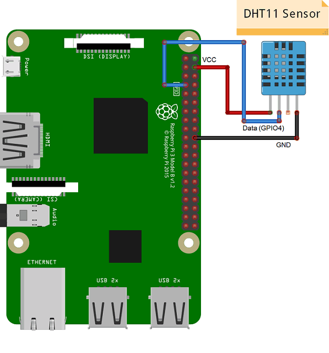
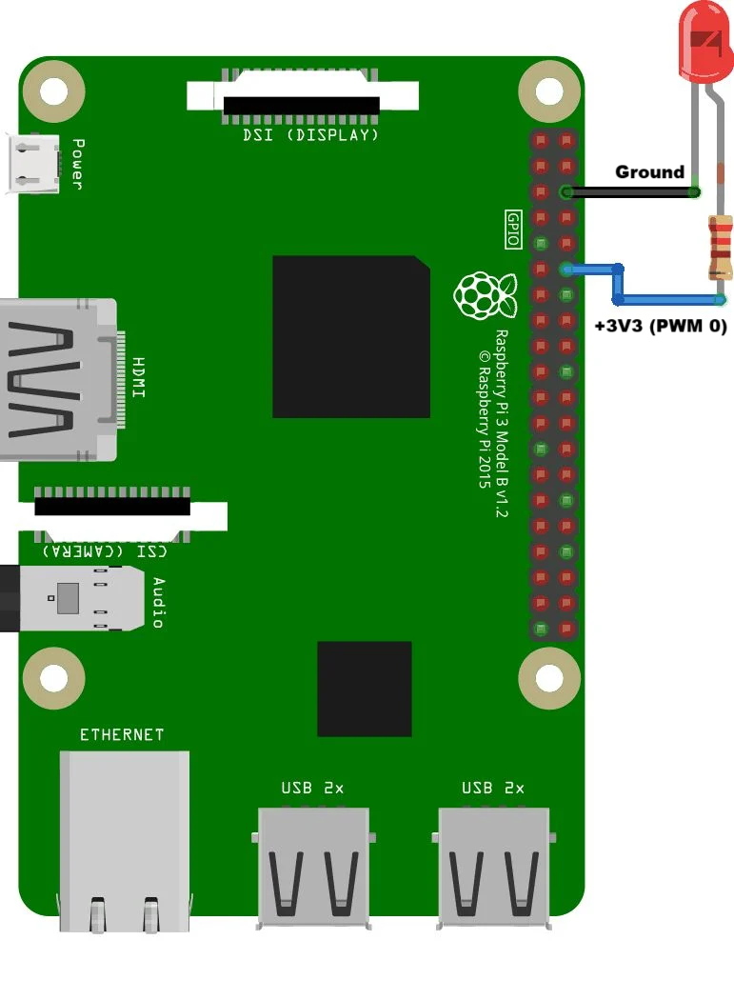

# Hardware Guide

## 1. Raspberry Pi pin map (BCM numbering)

The defaults below are **conflict-free**, so every module can run on one Pi at the same time. Override any pin with the matching `PIN_*` variable in `raspberry-pi/.env`.

| Function | Device pin | BCM GPIO | Physical pin | Notes |
|----------|-----------|----------|--------------|-------|
| LED / PWM LED | Anode via 220 Ω | **18** | 12 | Hardware PWM0 |
| PIR motion | OUT | **17** | 11 | HC-SR501 output is 3.3 V TTL; VCC 5 V |
| DHT11 | DATA | **4** | 7 | Module has an on-board 10 kΩ pull-up; VCC 3.3–5 V |
| HC-SR04 | TRIG | **5** | 29 | |
| HC-SR04 | ECHO | **6** | 31 | ⚠️ **5 V output: use a 1 kΩ / 2 kΩ divider** |
| Buzzer | + | **23** | 16 | Active buzzer; set `BUZZER_ACTIVE_LOW` if needed |
| LDR module | DO | **26** | 37 | DO = LOW in light, HIGH in darkness |
| Relay | IN | **19** | 35 | Most modules are active-LOW (`RELAY_ACTIVE_LOW=true`) |
| TM1637 | CLK | **21** | 40 | VCC 5 V |
| TM1637 | DIO | **20** | 38 | |
| AC dimmer | Z-C | **27** | 13 | Zero-cross detector output |
| AC dimmer | PWM / gate | **22** | 15 | Opto-isolated TRIAC gate |

> The original standalone prototype scripts re-used GPIO 17/18 across several modules (ultrasonic TRIG, dimmer gate and LED were all on 18). The unified map above removes those conflicts.

### Wiring references

| DHT11 → Raspberry Pi | PWM LED → Raspberry Pi |
|:--:|:--:|
|  |  |

### HC-SR04 echo level shifting
```
HC-SR04 ECHO ──[1 kΩ]──┬── GPIO 6
                        │
                     [2 kΩ]
                        │
                       GND          V_gpio = 5 V × 2k / (1k + 2k) ≈ 3.3 V
```

## 2. ESP32 node

| Function | ESP32 pin | Notes |
|----------|-----------|-------|
| LED / relay IN | GPIO 2 | On-board LED on most dev boards |

Blynk template datastreams: **V0** Switch (integer 0–1, write) and **V1** LED (integer 0–1, read).

## 3. Arduino UNO R4 WiFi node

| Function | Pin | Notes |
|----------|-----|-------|
| LDR divider output | A0 | LDR + 10 kΩ divider |
| Relay IN | D8 | Active-LOW |

Calibrate `DARK_THRESHOLD` / `LIGHT_THRESHOLD` with *Tools → Serial Plotter* at 9600 baud.

## 4. Component reference

| Component | Key specification |
|-----------|-------------------|
| DHT11 | 0–50 °C ±2 °C, 20–80 %RH ±5 %, max 1 Hz sampling |
| HC-SR04 | 5 V, ~15 mA, 2–400 cm, ~3 mm resolution, 15° beam, 40 kHz |
| HC-SR501 | 5–12 V supply, 3.3 V TTL output, adjustable delay and sensitivity |
| TM1637 | 3.3–5 V, 80 mA max, 8 brightness levels, proprietary 2-wire bus |
| LDR (GL55-series) | 1.8–4.5 kΩ at 10 lux, 0.7 kΩ at 100 lux, ≥0.25 MΩ dark resistance |
| Relay (SRD-05VDC-SL-C) | 5 V coil, contacts 10 A at 250 VAC / 30 VDC |

## 5. ⚠️ Mains-voltage safety

The relay and TRIAC-dimmer circuits switch **230 V AC**, which can kill.

- Use **opto-isolated** relay and dimmer modules, mounted in a closed, insulated enclosure.
- Never work on the high-voltage side while it is connected to mains.
- Add a fuse on the live conductor, size wires for the load current, and keep creepage distance between low- and high-voltage tracks.
- Use only **dimmable** lamps with the TRIAC dimmer.
- If in doubt, demonstrate with a 12 V DC load (e.g. the 12 V fan) instead.
