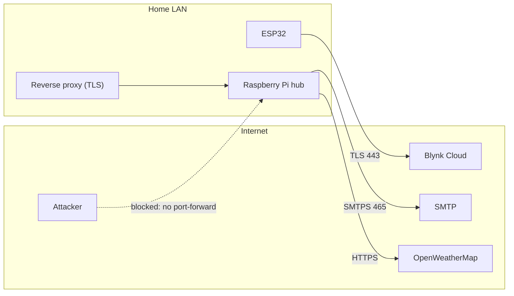

# Security Model

## 1. Assets
| Asset | Impact if compromised |
|-------|-----------------------|
| Actuator control (lights, relays, mains dimmer) | Physical safety, privacy (presence inference), nuisance |
| Sensor history (motion, climate) | Occupancy patterns reveal when the home is empty |
| Credentials: Blynk token, SMTP app password, OWM key, API token | Device takeover, mail abuse, quota or billing abuse |

## 2. Trust boundaries

## 3. STRIDE analysis

| STRIDE | Threat | Mitigation in this repo |
|--------|--------|-------------------------|
| **S**poofing | Unauthenticated client toggles devices | Bearer token (≥24 chars, `secrets.token_urlsafe`), constant-time `hmac.compare_digest`; service refuses to start without a strong token |
| **T**ampering | Malicious payload, SQL injection, command injection | Allow-list validation; parameterised SQL; `subprocess.run([...])` without a shell; 1 KB request-size cap |
| **R**epudiation | Who switched the light? | `led_data.source` records `api` / `pir` / `gui` with a timestamp |
| **I**nformation disclosure | Secrets in Git; token sniffed on Wi-Fi; API key in logs | `.env` / `secrets.h` git-ignored and gitleaks in CI; ESP32 uses Blynk **TLS**; SMTPS with certificate verification; the OWM client strips the URL (and key) from error messages; `Cache-Control: no-store` on the API |
| **D**enial of service | Alert flooding; hung sensor reads | Alert cooldown rate limiter; ultrasonic echo timeout; non-blocking e-mail thread |
| **E**levation of privilege | Browser-based attacks against the dashboard | CSP `default-src 'self'`, no inline JS, `X-Frame-Options: DENY`, `nosniff`, `Referrer-Policy: no-referrer`; POST-only state changes defeat CSRF via ``/link tricks; the token lives in `sessionStorage` (not a cookie), so it is never sent automatically |

## 4. Secure defaults
- API bound to **loopback** (`127.0.0.1`) unless explicitly changed.
- All actuators initialise **OFF** and are driven LOW in `finally:` blocks on exit.
- Firmware defaults the output LOW before networking starts.

## 5. Residual risks and recommendations
| Risk | Recommendation |
|------|----------------|
| Flask's built-in server is not hardened for internet exposure | Run behind Nginx/Caddy with TLS, or serve through `waitress`/`gunicorn`; prefer VPN access |
| Single shared API token | Add per-user tokens or OAuth2 / OIDC for multi-user homes |
| Blynk is a third-party cloud dependency | Self-host MQTT (Mosquitto with TLS and ACLs) for full data sovereignty (roadmap) |
| Firmware is not signed | Enable ESP32 Secure Boot v2 and flash encryption for production units |
| Raspberry Pi OS hardening | Disable password SSH (keys only), enable `ufw`, turn on unattended upgrades, change default credentials |
